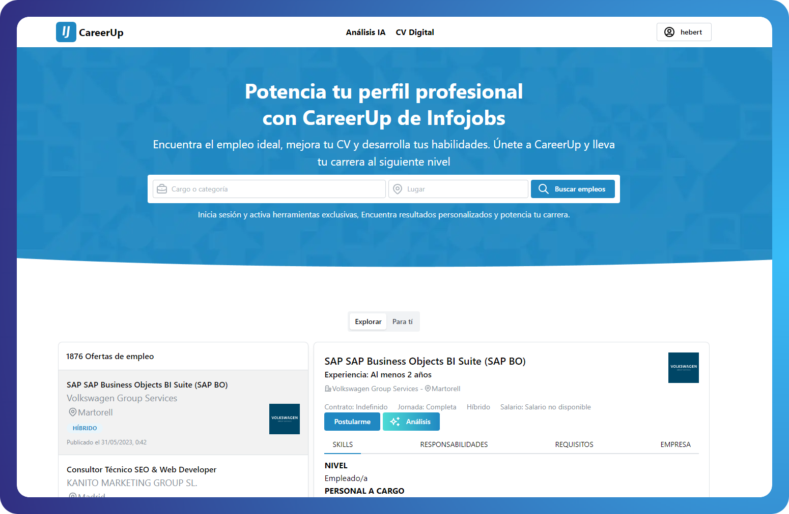

<h1 align="center">Infojobs CareerUp</h1>
<h2 align="center">La mejor experiencia para buscar empleo</h2>
<!-- 
<a href="https://chatpad.ai">Web App</a> & <a href="https://download.chatpad.ai">Desktop App</a>
 -->

<a href="https://infojobs.hebertdev.net">Web App</a> 

CareerUp es una plataforma de búsqueda de empleo inteligente diseñada para ayudarte a avanzar en tu carrera. Con características innovadoras y el uso de IA, CareerUp te ofrece una experiencia personalizada y eficiente en tu búsqueda de trabajo.

### ⚡️ Free and open source

This app is provided for free and the source code is available on GitHub.

### 🔒 Privacy focused

No tracking

### ✨ Best experience

Crafted with love and care to provide the best experience possible.

## Give Feedback

If you have any feature requests or bug reports, go to [Twitter|hebertdev](https://twitter.com/hebertdev1).

## Contribution

This is a Next.js application built with Vite and TypeScript. To run the project, clone it and run the following commands:

`npm install`
`npm run dev`
`npm run build`

And you're good to go to start contributing!

A small part is built in Django: https://github.com/hebertdev/infojobs_api

## Credits

- [MANTINEUI](https://mantine.dev/) - A fully featured React component library
